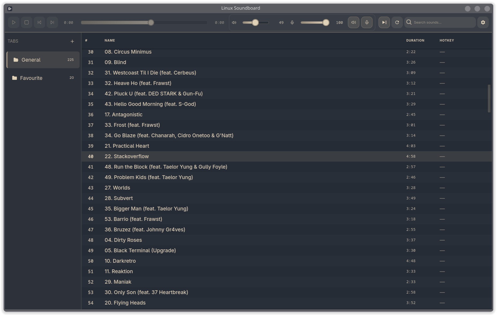
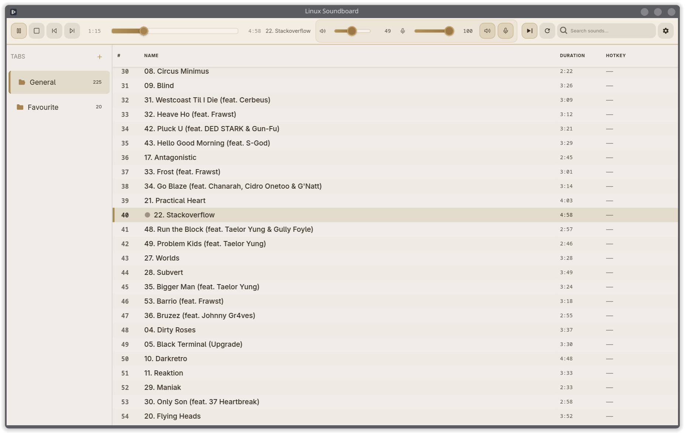
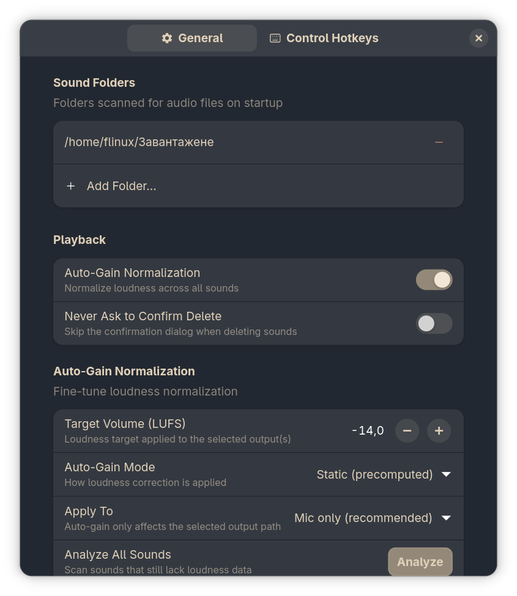
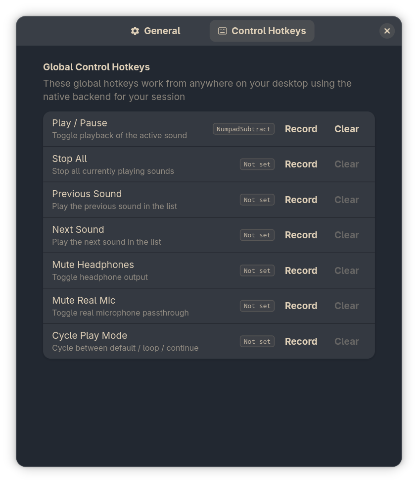

<p align="center">
  
</p>

<h1 align="center">Linux Soundboard</h1>

<p align="center">
  Native Linux soundboard with PipeWire virtual microphone support, LUFS normalization, and global hotkeys for Wayland and X11.
</p>

<p align="center">
  <a href="https://github.com/germanua/Linux-SoundBoard/releases/latest">
    
  </a>
  <a href="https://aur.archlinux.org/packages/linux-soundboard-git">
    
  </a>
  <a href="LICENSE">
    
  </a>
</p>

<p align="center">
  <a href="https://github.com/germanua/Linux-SoundBoard/releases/latest"><strong>Download Release</strong></a>
  ·
  <a href="docs/INSTALL.md"><strong>Installation Guide</strong></a>
  ·
  <a href="docs/SCREENSHOTS.md"><strong>Screenshot Gallery</strong></a>
  ·
  <a href="docs/TROUBLESHOOTING.md"><strong>Troubleshooting</strong></a>
  ·
  <a href="docs/BUG_REPORTS.md"><strong>Bug Reports</strong></a>
</p>

## Overview

Linux Soundboard routes sound effects into a virtual microphone so they can be used in Discord, OBS, Zoom, game chat, and any other app that accepts a standard audio input. It is built with Rust, GTK4, and Libadwaita and targets native Linux workflows instead of Electron wrappers or browser-based mixers.

Core capabilities:

- Virtual microphone output via PipeWire and PulseAudio tools
- Mic passthrough so your voice and soundboard audio share one input device
- LUFS normalization for consistent playback loudness
- Global hotkeys with `swhkd` on Wayland and a native X11 backend on X11/XWayland
- Sound library tabs, folder sync, drag and drop, and separate output levels for speakers and mic

## Screenshots

<p align="center">
  
</p>

<p align="center">
  
</p>

<p align="center">
  
  
</p>

See the full gallery in [docs/SCREENSHOTS.md](docs/SCREENSHOTS.md).

## Install

Use the method that matches your system:

| Platform | Recommended path | Notes |
| --- | --- | --- |
| Arch Linux | `yay -S linux-soundboard-git` | AUR package |
| Ubuntu / Debian | GitHub release `.deb` | Native package install |
| Fedora | GitHub release `.rpm` | Native package install |
| Any x86_64 distro | AppImage | Portable build from Releases |
| Flatpak users | Build from repo manifest | Flathub listing is not published yet |

Detailed commands, bootstrap setup, and source builds live in [docs/INSTALL.md](docs/INSTALL.md).

## Quick Start

1. Install the application from a release package, AppImage, or the AUR.
2. Launch `linux-soundboard`.
3. In Discord, OBS, Zoom, or another target app, select `Linux_Soundboard_Mic` as the input device.
4. Add a folder or drag audio files into the library.
5. If you are on Wayland, make sure `swhkd` is installed so global hotkeys can work outside the app window.

## Display Server Support

| Session | UI backend | Global hotkeys |
| --- | --- | --- |
| Wayland | Native GTK Wayland | `swhkd` |
| X11 | Native GTK X11 | Built-in X11/XInput2 backend |
| XWayland | Native GTK X11 when forced | Built-in X11/XInput2 backend |

If you run the app inside VMware and the UI becomes unresponsive or RAM spikes, see the renderer notes in [docs/TROUBLESHOOTING.md](docs/TROUBLESHOOTING.md).

## Documentation

- [Installation Guide](docs/INSTALL.md)
- [Screenshot Gallery](docs/SCREENSHOTS.md)
- [Troubleshooting Guide](docs/TROUBLESHOOTING.md)
- [Bug Reporting Guide](docs/BUG_REPORTS.md)
- [Changelog](docs/CHANGELOG.md)

## Build From Source

If you want a local native build:

```bash
git clone https://github.com/germanua/Linux-SoundBoard.git
cd Linux-SoundBoard/src
cargo build --release
./target/release/linux-soundboard
```

System dependency setup for Debian, Fedora, and Arch is documented in [docs/INSTALL.md](docs/INSTALL.md).

## Support

- Issues: https://github.com/germanua/Linux-SoundBoard/issues
- Discussions: https://github.com/germanua/Linux-SoundBoard/discussions
- AUR package: https://aur.archlinux.org/packages/linux-soundboard-git

Bug report expectations are documented in [docs/BUG_REPORTS.md](docs/BUG_REPORTS.md).

## License

Linux Soundboard is licensed under the PolyForm Noncommercial 1.0.0 license. Commercial use requires a separate license. See [LICENSE](LICENSE).
