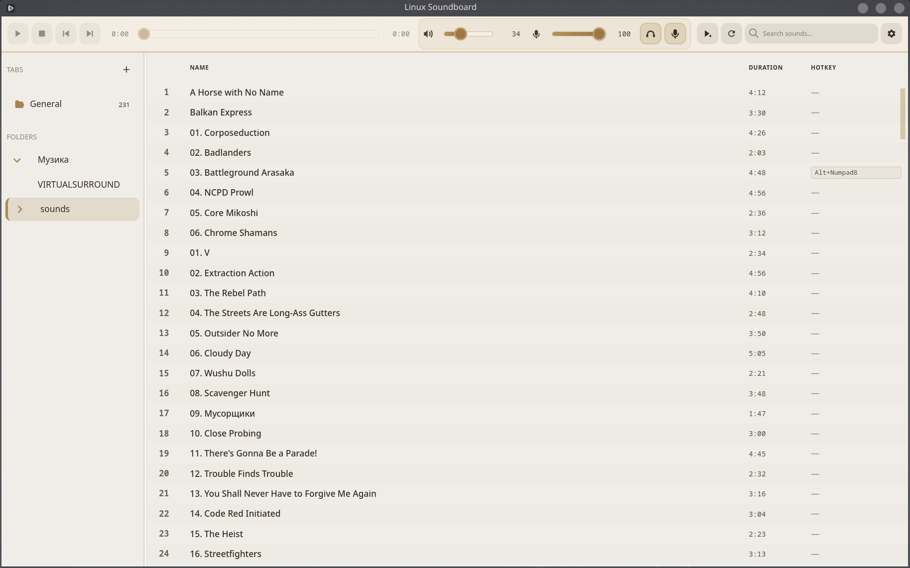
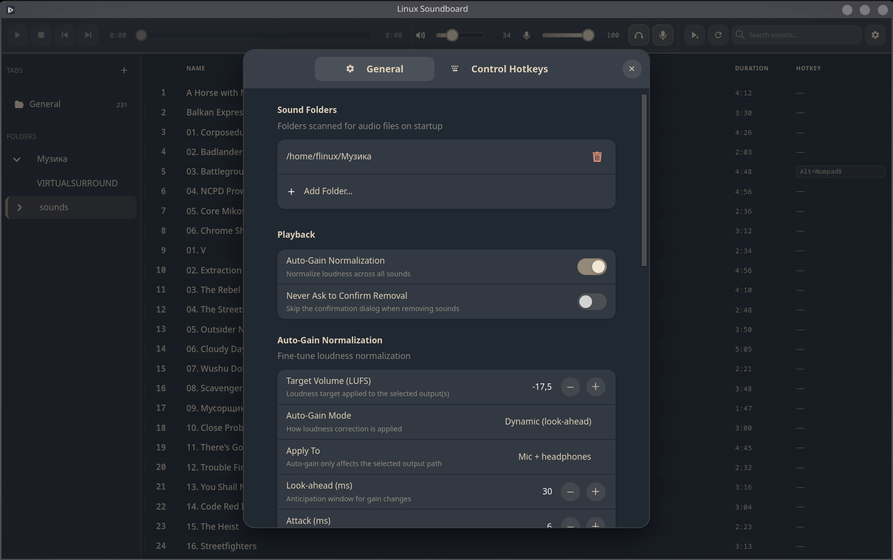
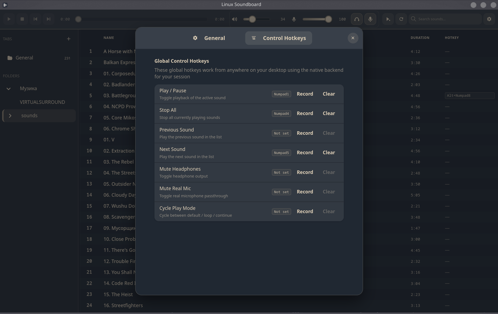

<h1 align="center">Linux Soundboard</h1>

<p align="center">
  Native Linux soundboard with PipeWire virtual microphone, microphone passthrough, LUFS normalization, and global hotkeys for Wayland and X11.
</p>

<p align="center">
  <a href="https://github.com/germanua/Linux-SoundBoard/releases/latest">
    
  </a>
  <a href="https://aur.archlinux.org/packages/linux-soundboard">
    
  </a>
  <a href="LICENSE">
    
  </a>
</p>

<p align="center">
  <a href="https://ko-fi.com/sherpi">
    
  </a>
</p>

<p align="center">
  <a href="https://github.com/germanua/Linux-SoundBoard/releases/latest"><strong>Download</strong></a>
  ·
  <a href="docs/INSTALL.md"><strong>Install Guide</strong></a>
  ·
  <a href="docs/FEATURE_REFERENCE.md"><strong>Feature Reference</strong></a>
  ·
  <a href="docs/SCREENSHOTS.md"><strong>Screenshots</strong></a>
  ·
  <a href="docs/TROUBLESHOOTING.md"><strong>Troubleshooting</strong></a>
  ·
  <a href="docs/LEGAL.md"><strong>Legal</strong></a>
</p>

<p align="center"><b>Install with one command:</b></p>

```bash
curl -fsSL https://raw.githubusercontent.com/germanua/Linux-SoundBoard/main/install.sh | bash
```

<p align="center">Opens a menu: install, install a previous version, repair, uninstall, check status, or generate a bug report.<br>
Sets up the runtime audio engine, desktop entry, and icons automatically, and records your audio setup first so uninstalling can put it back.</p>

---

## What it does

Linux Soundboard sends audio clips to your speakers and to a PipeWire virtual
microphone named `Linux_Soundboard_Mic`. Select that input in Discord, OBS,
Zoom, games, or any other application with a microphone selector.

Microphone passthrough mixes your voice with soundboard playback. The GTK4
window and audio engine run as separate processes, so the virtual microphone
can remain available after the window closes.

---

## Screenshots

<p align="center">
  
</p>

<p align="center">
  
</p>

<p align="center">
  
  
</p>

<p align="center">
  <a href="docs/SCREENSHOTS.md"><strong>View the full screenshot gallery</strong></a>
</p>

---

## Install

The command at the top of this page detects the distribution and uses the
matching install path.

| Distribution | Default install method |
| --- | --- |
| Arch / CachyOS / EndeavourOS | Stable `linux-soundboard` AUR package through `yay` or `paru` |
| Debian / Ubuntu | Native `.deb` package |
| Fedora | Native `.rpm` package |
| Other distributions | Release tarball with the per-user installer |

> **Privileges:** Native packages and the Wayland hotkey helper may ask for
> your password. Per-user AppImage and tarball installs under `~/.local` do
> not.

> **Download integrity:** `install.sh` rejects a GitHub release asset unless
> its SHA-256 matches a valid entry in the release's `SHA256SUMS.txt`.

### AppImage

```bash
chmod +x linux-soundboard-x86_64.AppImage
./linux-soundboard-x86_64.AppImage
```

On first launch, choose **Install for persistent virtual mic**, **Run
temporarily**, or **Exit**. A persistent install keeps the AppImage under your
user account and starts the audio engine as a systemd user service.

### Inspect before running

Download a package or AppImage from the
[Releases page](https://github.com/germanua/Linux-SoundBoard/releases/latest),
or download
[`install.sh`](https://raw.githubusercontent.com/germanua/Linux-SoundBoard/main/install.sh)
and inspect it first.

See [docs/INSTALL.md](docs/INSTALL.md) for version selection, repair, status,
uninstall, AppImage, and source-install commands.

---

## Quick start

1. Install and launch Linux Soundboard.
2. Add a sound folder, or drag files into the window.
3. Select `Linux_Soundboard_Mic` as the input in Discord, OBS, Zoom, or your
   game.
4. Enable microphone passthrough to mix your real microphone with playback.
5. Assign hotkeys if you want to trigger sounds outside the window.

**Microphone Routing** defaults to automatic routing. Switch it to **Manual**
if you manage the default input with pavucontrol or another audio tool.

---

## How it works

```text
┌─────────────────────────────────────────────────────┐
│  GTK4 UI                                            │
│  Library, search, transport, settings, hotkeys      │
└──────────────────────────┬──────────────────────────┘
                           │ Unix socket IPC
┌──────────────────────────▼──────────────────────────┐
│  linux-soundboard-engine.service                    │
│  Playback, mic mixing, volume, seeking, looping     │
└──────────────────────┬───────────────────────┬──────┘
                       │                       │
                   Speakers          Linux_Soundboard_Mic
```

The engine owns the audio streams and runtime virtual microphone. The UI sends
commands over a Unix socket. Closing the UI stops active sounds, but the engine
service and virtual microphone can stay running.

---

## Features

### Playback

- **Normalization:** Per-sound LUFS gain across every supported format
- **Play modes:** Play once, loop, or continue to the next sound
- **Transport:** Play, pause, stop, previous, next, and seek
- **Output levels:** Separate speaker and virtual-microphone volume
- **Microphone boost:** Optional loudness gain for mic passthrough

### Audio routing

- **Runtime virtual mic:** Created by the audio engine, not a permanent
  PipeWire configuration
- **Mic passthrough:** Mixes the selected real microphone with sound playback
- **Default mode:** Sets `Linux_Soundboard_Mic` as the default recording input
- **Manual mode:** Leaves default-source selection to the user
- **EasyEffects:** Can capture the processed microphone source

### Library

- **Folders:** Add, remove, reorder, combine, restore, and rescan folders
- **Tabs:** Organize sounds without moving source files
- **SQLite storage:** Sounds, folders, tabs, and hotkeys live in
  `library.sqlite3`
- **Large libraries:** Loaded in bounded pages
- **Drag and drop:** Add files or folders from a file manager
- **Search:** Filter the visible sound list
- **Hotkeys:** Per-sound bindings and shared playback controls

### Desktop

- **Wayland hotkeys:** `swhkd`
- **X11 and XWayland hotkeys:** Native XInput2
- **System tray:** `StatusNotifierItem`
- **Media controls:** Optional MPRIS integration
- **Background audio:** systemd user service

### Audio formats

| Format | Support |
| --- | --- |
| MP3 | Yes |
| Ogg Vorbis | Yes |
| Ogg Opus | Mono and stereo |
| FLAC | Yes |
| AAC | AAC-LC |
| M4A | AAC-LC and ALAC |
| MP4 audio | AAC-LC, ALAC, mono Opus, and stereo Opus |
| WebM | No |
| Multichannel Opus | No |

See [docs/FEATURE_REFERENCE.md](docs/FEATURE_REFERENCE.md) for every control,
setting, and menu.

---

## Global hotkeys

| Session | Backend | Setup |
| --- | --- | --- |
| Wayland | `swhkd` | Installed through the app or installer |
| X11 | Native XInput2 | None |
| XWayland | Native XInput2 | None when the X11 backend is used |

Wayland hotkeys require direct keyboard access. Linux Soundboard still works
without `swhkd`; only Wayland global hotkeys are unavailable.

---

## Known limitations

- **Wayland hotkeys:** The installer builds a pinned `swhkd` revision with
  rfkill handling disabled. Installation uses PolicyKit.
- **GNOME tray:** GNOME needs an AppIndicator-compatible extension for the tray
  icon.
- **AppImage updates:** Automatic replacement applies only to the AppImage kept
  as the persistent installed executable.
- **Microphone routing:** EasyEffects, Bluetooth profiles, PipeWire and
  WirePlumber configuration, and application-specific routing can change the
  result.

Start with [docs/TROUBLESHOOTING.md](docs/TROUBLESHOOTING.md) when audio routing
does not match the selected mode.

---

## Configuration and data

| Data | Path |
| --- | --- |
| Settings | `~/.config/linux-soundboard/config.json` |
| Sound library | `~/.config/linux-soundboard/library.sqlite3` |
| Installer state and backups | `~/.local/state/linux-soundboard/install-user/` |
| Engine socket | `$XDG_RUNTIME_DIR/linux-soundboard/engine.sock` |

Removing a sound from the library does not delete the original audio file.

---

## Build from source

<details>
<summary><strong>Arch Linux</strong></summary>

```bash
sudo pacman -S cargo rust pkgconf clang gtk4 libadwaita libpulse opus libx11 libxi pipewire pipewire-pulse wireplumber
```

</details>

<details>
<summary><strong>Debian / Ubuntu</strong></summary>

```bash
sudo apt install build-essential cargo rustc pkg-config \
  libgtk-4-dev libadwaita-1-dev libpulse-dev libopus-dev libpipewire-0.3-dev \
  libx11-dev libxi-dev libclang-dev pipewire pipewire-pulse wireplumber pulseaudio-utils
```

</details>

<details>
<summary><strong>Fedora</strong></summary>

```bash
sudo dnf install cargo rust gcc gcc-c++ clang-devel pkgconf-pkg-config \
  gtk4-devel libadwaita-devel pulseaudio-libs-devel opus-devel libX11-devel \
  libXi-devel pipewire-devel pipewire pipewire-utils pipewire-pulseaudio wireplumber pulseaudio-utils
```

</details>

```bash
git clone https://github.com/germanua/Linux-SoundBoard.git
cd Linux-SoundBoard
cargo build --release
./packaging/linux/install-user.sh install ./target/release/linux-soundboard
```

See [docs/INSTALL.md](docs/INSTALL.md) for the full source-build notes.

---

## Reporting bugs

```bash
./install.sh report
```

Attach the generated report. Include the distribution, desktop environment,
Wayland or X11 session, and PipeWire/WirePlumber versions.

[Open an issue](https://github.com/germanua/Linux-SoundBoard/issues) ·
[Start a discussion](https://github.com/germanua/Linux-SoundBoard/discussions) ·
[Bug reporting guide](docs/BUG_REPORTS.md)

---

## Documentation

| Document | Contents |
| --- | --- |
| [Installation guide](docs/INSTALL.md) | Install, downgrade, repair, uninstall, and source builds |
| [Feature reference](docs/FEATURE_REFERENCE.md) | Controls, settings, menus, and hotkeys |
| [Troubleshooting](docs/TROUBLESHOOTING.md) | Audio, PipeWire, hotkey, renderer, and packaging problems |
| [Bug reporting](docs/BUG_REPORTS.md) | Details to include in a report |
| [Screenshots](docs/SCREENSHOTS.md) | Full screenshot gallery |
| [Changelog](docs/CHANGELOG.md) | Release history |
| [Legal](docs/LEGAL.md) | License and redistribution rules |
| [Contributing](CONTRIBUTING.md) | Contribution guidelines |

---

## Contributing

Bug reports and focused pull requests are welcome. Read
[CONTRIBUTING.md](CONTRIBUTING.md) before submitting code.

For audio routing, installation, packaging, or hotkey changes, include the test
environment and validation steps.

---

## Support

Linux Soundboard is free for noncommercial use under its license.

[Ko-fi](https://ko-fi.com/sherpi) ·
[Donations and sponsorship terms](DONATIONS.md)

---

## License

Linux Soundboard is source-available under the
[PolyForm Noncommercial License 1.0.0](LICENSE).

- SPDX identifier: `PolyForm-Noncommercial-1.0.0`
- Required notice: `Required Notice: Copyright (c) 2026 germanua`
- Noncommercial use, modification, forks, and redistribution are allowed under
  the license terms.
- Commercial use, paid redistribution, resale, commercial bundling, or use in
  a commercial product or service requires a separate written commercial
  license.

This project is not OSI-approved open-source software.

Third-party components keep their own licenses:

- [THIRDPARTY_LICENSES.md](THIRDPARTY_LICENSES.md)
- [THIRD_PARTY_NOTICES.html](THIRD_PARTY_NOTICES.html)

Commercial licensing details are in
[COMMERCIAL-LICENSE.md](COMMERCIAL-LICENSE.md).

---

## Credits

Linux Soundboard uses Rust, GTK4, libadwaita, PipeWire, WirePlumber, PulseAudio
compatibility APIs, Symphonia, and other Rust and Linux libraries.

See [THIRDPARTY_LICENSES.md](THIRDPARTY_LICENSES.md) for the dependency overview
and [THIRD_PARTY_NOTICES.html](THIRD_PARTY_NOTICES.html) for generated Rust
dependency notices.
