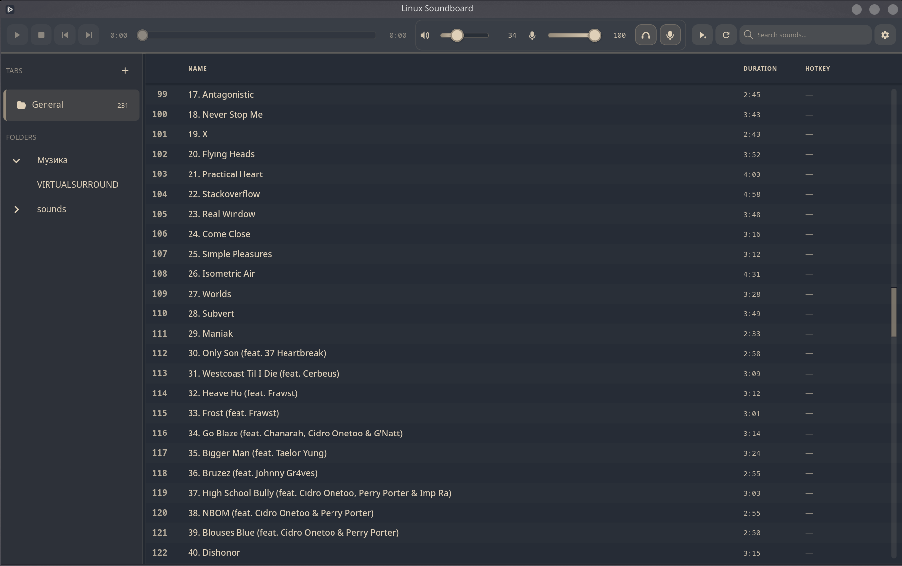

# Linux Soundboard

Native Linux soundboard with a PipeWire virtual microphone, microphone
passthrough, LUFS normalization, and global hotkeys.

[Latest release](https://github.com/germanua/Linux-SoundBoard/releases/latest) ·
[AUR](https://aur.archlinux.org/packages/linux-soundboard) ·
[Install guide](docs/INSTALL.md) ·
[Troubleshooting](docs/TROUBLESHOOTING.md) ·
[Changelog](docs/CHANGELOG.md)



Linux Soundboard plays audio clips to your speakers and to a virtual microphone
named `Linux_Soundboard_Mic`. Select that input in Discord, OBS, Zoom, games,
or any other application that lets you choose a microphone.

The UI is written in Rust with GTK4 and libadwaita. Audio runs in a separate
user service, so the virtual microphone and microphone passthrough can remain
available when the window is closed.

## Install

The installer supports Arch-based distributions, Debian/Ubuntu, Fedora, and
other Linux distributions:

```bash
curl -fsSL https://raw.githubusercontent.com/germanua/Linux-SoundBoard/main/install.sh | bash
```

Run it in a terminal to open an interactive menu for installing, downgrading,
repairing, uninstalling, checking status, or generating a bug report.

The installer tells you before an action needs elevated privileges. Native
packages and the Wayland hotkey helper may require your password; per-user
AppImage and tarball installs under `~/.local` do not.

| Distribution | Default install method |
| --- | --- |
| Arch / CachyOS / EndeavourOS | Stable AUR package through `yay` or `paru` |
| Debian / Ubuntu | Native `.deb` package |
| Fedora | Native `.rpm` package |
| Other distributions | Release tarball with the per-user installer |

When `install.sh` downloads a GitHub release asset, it accepts it only when its
SHA-256 matches the release's `SHA256SUMS.txt`.

Full installer options are documented in [docs/INSTALL.md](docs/INSTALL.md).

### Prefer not to use the one-line installer?

Download a package or AppImage from the
[Releases page](https://github.com/germanua/Linux-SoundBoard/releases/latest),
or download
[`install.sh`](https://raw.githubusercontent.com/germanua/Linux-SoundBoard/main/install.sh)
first and inspect it before running it.

For AppImage:

```bash
chmod +x linux-soundboard-x86_64.AppImage
./linux-soundboard-x86_64.AppImage
```

On first launch, the AppImage can run temporarily or install itself under your
user account with the persistent audio engine.

## Quick start

1. Install Linux Soundboard and launch it.
2. Add a folder containing your sound files, or drag files into the window.
3. In Discord, OBS, Zoom, or another application, select
   `Linux_Soundboard_Mic` as the input device.
4. Enable microphone passthrough if you want your real microphone mixed with
   soundboard playback.
5. Assign hotkeys to sounds if you want to trigger them outside the
   application.

If automatic microphone routing does not fit your setup, switch
**Microphone Routing** to **Manual** and manage the active input yourself.

## Features

### Audio

- Runtime PipeWire virtual microphone
- Microphone passthrough
- Independent speaker and virtual-microphone volume
- Per-sound LUFS normalization
- Optional microphone loudness boost
- Play, pause, stop, seek, previous, and next controls
- Play once, loop, and continue-to-next playback modes
- EasyEffects-aware microphone routing

### Library

- Folder-based sound library
- Tabs
- Search
- Drag and drop
- Folder rescan and sync
- SQLite-backed library
- Per-sound and shared hotkeys
- Bounded paging for large libraries

### Desktop integration

- Wayland global hotkeys through `swhkd`
- Native XInput2 hotkeys on X11 and XWayland
- System tray support through `StatusNotifierItem`
- Optional MPRIS media controls
- Persistent audio engine through a systemd user service

### Audio formats

Supported:

- MP3
- Ogg Vorbis
- Ogg Opus, mono or stereo
- FLAC
- AAC-LC
- M4A with AAC-LC or ALAC
- MP4 audio tracks with AAC-LC, ALAC, or mono/stereo Opus

Not currently supported:

- WebM
- Multichannel Opus

See [docs/FEATURE_REFERENCE.md](docs/FEATURE_REFERENCE.md) for the complete UI
and feature reference.

## Known limitations

- Wayland global hotkeys require direct keyboard access through `swhkd`.
  Linux Soundboard installs it through PolicyKit when needed. The installer
  uses a pinned upstream revision with rfkill handling disabled.
- GNOME does not provide a tray by default. Install an AppIndicator-compatible
  extension if you want the tray icon.
- Automatic AppImage replacement applies only when the AppImage is kept as the
  persistent installed executable.
- Microphone passthrough, PipeWire/WirePlumber configuration, EasyEffects,
  Bluetooth audio profiles, and application-specific routing can affect
  microphone behavior.
- The project is source-available under a noncommercial license. It is not
  OSI-approved open-source software.

If audio routing behaves unexpectedly, start with
[docs/TROUBLESHOOTING.md](docs/TROUBLESHOOTING.md).

## How it works

The window and the audio engine are separate processes:

```text
GTK4 UI ── Unix socket ──> systemd user audio engine
                              ├─> speakers
                              └─> Linux_Soundboard_Mic
```

The audio engine owns the runtime audio streams and virtual microphone. The GTK
process is responsible for the interface and sends commands to the engine over
a Unix socket.

Closing the window does not have to stop the engine. Whether the application
stays available in the background depends on your tray and background settings.

## Global hotkeys

| Session | Backend | Extra setup |
| --- | --- | --- |
| Wayland | `swhkd` | Installed through the app or installer |
| X11 | XInput2 | None |
| XWayland | XInput2 | None when the X11 backend is used |

Wayland hotkeys require direct keyboard access. If you do not want the helper
installed, the soundboard itself still works without Wayland global hotkeys.

## Configuration and data

User settings are stored in:

```text
~/.config/linux-soundboard/config.json
```

The sound library is stored in:

```text
~/.config/linux-soundboard/library.sqlite3
```

The per-user installer keeps managed-file records, backups, and the
pre-installation audio snapshot under:

```text
~/.local/state/linux-soundboard/install-user/
```

Removing a sound from the library does not delete the original audio file.

## Build from source

Install the build dependencies for your distribution.

### Arch

```bash
sudo pacman -S cargo rust pkgconf clang gtk4 libadwaita libpulse opus libx11 libxi pipewire pipewire-pulse wireplumber
```

### Debian / Ubuntu

```bash
sudo apt install build-essential cargo rustc pkg-config \
  libgtk-4-dev libadwaita-1-dev libpulse-dev libopus-dev libpipewire-0.3-dev \
  libx11-dev libxi-dev libclang-dev pipewire pipewire-pulse wireplumber pulseaudio-utils
```

### Fedora

```bash
sudo dnf install cargo rust gcc gcc-c++ clang-devel pkgconf-pkg-config \
  gtk4-devel libadwaita-devel pulseaudio-libs-devel opus-devel libX11-devel \
  libXi-devel pipewire-devel pipewire pipewire-utils pipewire-pulseaudio wireplumber pulseaudio-utils
```

Build and install for your user:

```bash
git clone https://github.com/germanua/Linux-SoundBoard.git
cd Linux-SoundBoard
cargo build --release
./packaging/linux/install-user.sh install ./target/release/linux-soundboard
```

See [docs/INSTALL.md](docs/INSTALL.md) for source-build and installer details.

## Reporting bugs

Before opening an issue, run:

```bash
./install.sh report
```

You can also use the application's diagnostics where available.

Include your distribution, desktop environment, Wayland/X11 session,
PipeWire/WirePlumber versions, and the generated report when they are relevant
to the problem.

See [docs/BUG_REPORTS.md](docs/BUG_REPORTS.md).

Issues: <https://github.com/germanua/Linux-SoundBoard/issues>

Discussions: <https://github.com/germanua/Linux-SoundBoard/discussions>

## Documentation

| Document | Purpose |
| --- | --- |
| [Installation guide](docs/INSTALL.md) | Install, downgrade, repair, uninstall, and source builds |
| [Feature reference](docs/FEATURE_REFERENCE.md) | UI behavior, controls, settings, and hotkeys |
| [Troubleshooting](docs/TROUBLESHOOTING.md) | Audio, PipeWire, hotkey, renderer, and packaging problems |
| [Bug reporting](docs/BUG_REPORTS.md) | Information to include in a useful report |
| [Screenshots](docs/SCREENSHOTS.md) | Additional screenshots |
| [Changelog](docs/CHANGELOG.md) | Release history |
| [Legal](docs/LEGAL.md) | License model and redistribution rules |
| [Contributing](CONTRIBUTING.md) | Contribution guidelines |

## License

Linux Soundboard is source-available under the
[PolyForm Noncommercial License 1.0.0](LICENSE).

Noncommercial use, modification, forks, and redistribution are allowed under
the license terms. Commercial use, paid redistribution, resale, commercial
bundling, or use in a commercial product or service requires a separate written
commercial license.

This project should not be described as OSI-approved open-source software.

Third-party components keep their own licenses:

- [THIRDPARTY_LICENSES.md](THIRDPARTY_LICENSES.md)
- [THIRD_PARTY_NOTICES.html](THIRD_PARTY_NOTICES.html)

Commercial licensing details are in
[COMMERCIAL-LICENSE.md](COMMERCIAL-LICENSE.md).

## Contributing

Bug reports and focused pull requests are welcome. Read
[CONTRIBUTING.md](CONTRIBUTING.md) before submitting code.

For changes that affect audio routing, installation, packaging, or hotkeys,
include the environment you tested and the relevant validation steps.

## Support

Linux Soundboard is free to use for noncommercial purposes under its license.

If the project is useful to you and you want to support its maintenance:

- Ko-fi: <https://ko-fi.com/sherpi>
- [Donations and sponsorship terms](DONATIONS.md)

## Credits

Linux Soundboard uses Rust, GTK4, libadwaita, PipeWire, WirePlumber, PulseAudio
compatibility APIs, Symphonia, and other Rust and Linux ecosystem libraries.

See [THIRDPARTY_LICENSES.md](THIRDPARTY_LICENSES.md) for the dependency overview
and [THIRD_PARTY_NOTICES.html](THIRD_PARTY_NOTICES.html) for generated Rust
dependency notices.
