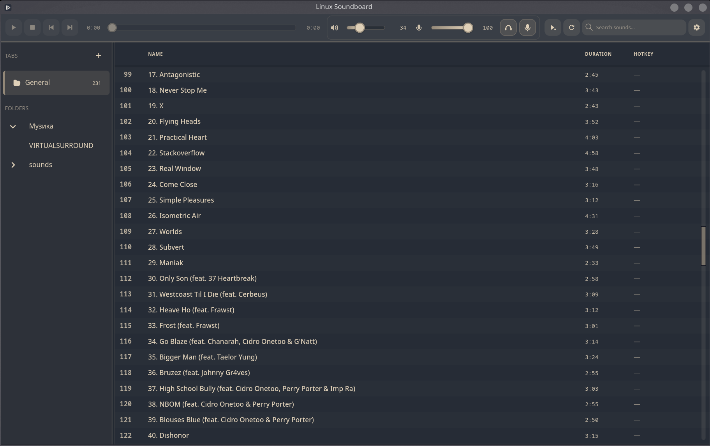
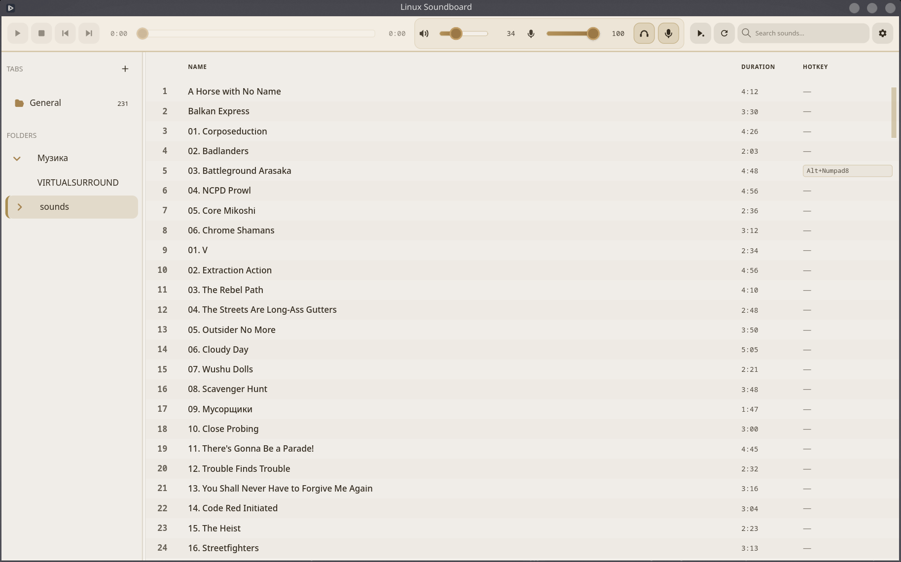
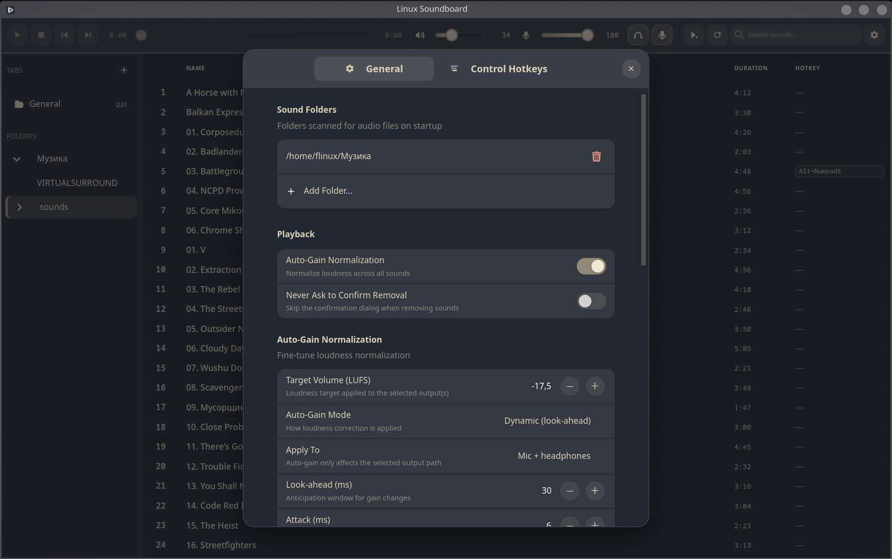
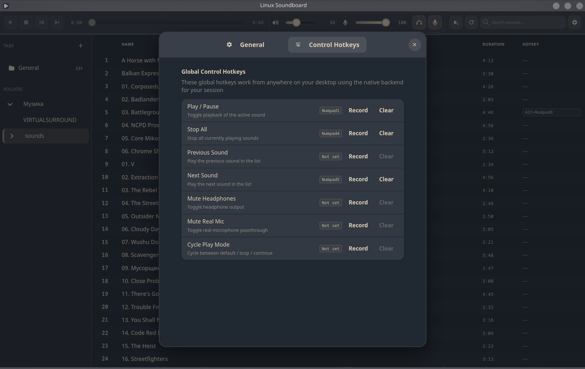

<h1 align="center">Linux Soundboard</h1>

<p align="center">
  Native Linux soundboard with a PipeWire virtual microphone, microphone passthrough, LUFS normalization, concurrent playback, and global hotkeys for Wayland and X11.
</p>

<p align="center">
  <a href="https://github.com/germanua/Linux-SoundBoard/releases/latest">
    
  </a>
  <a href="LICENSE">
    
  </a>
</p>

Linux Soundboard plays audio to your speakers and a virtual microphone named `Linux_Soundboard_Mic`, so sounds can be routed directly into Discord, OBS, games, calls, and other applications. It also supports mixing your real microphone with soundboard playback.

## Install

Current public releases use an **x86_64 AppImage**. The recommended installer downloads and verifies the release automatically:

```bash
curl -fsSL https://raw.githubusercontent.com/germanua/Linux-SoundBoard/main/bootstrap-install.sh | bash
```

For manual downloads, older versions, repair, uninstall, and verification, see the [installation guide](docs/INSTALL.md) or the [Releases page](https://github.com/germanua/Linux-SoundBoard/releases/latest).

## Screenshots

<p align="center">
  
</p>

<p align="center">
  
</p>

<p align="center">
  
  
</p>

<p align="center">
  <a href="docs/SCREENSHOTS.md"><strong>View the full screenshot gallery</strong></a>
</p>

## Documentation

- [Installation](docs/INSTALL.md)
- [Feature reference](docs/FEATURE_REFERENCE.md)
- [Troubleshooting](docs/TROUBLESHOOTING.md)
- [Bug reporting](docs/BUG_REPORTS.md)
- [Full screenshot gallery](docs/SCREENSHOTS.md)

## Changelog

See [docs/CHANGELOG.md](docs/CHANGELOG.md) for release history, new features, fixes, and other changes.

## Contributing

Bug reports and focused pull requests are welcome. Read [CONTRIBUTING.md](CONTRIBUTING.md) before submitting changes.

- [Open an issue](https://github.com/germanua/Linux-SoundBoard/issues)
- [Start a discussion](https://github.com/germanua/Linux-SoundBoard/discussions)

## License

Linux Soundboard is source-available under the [PolyForm Noncommercial License 1.0.0](LICENSE).

Noncommercial use, modification, forks, and redistribution are allowed under the license terms. Commercial use, paid redistribution, resale, commercial bundling, or use in a commercial product or service requires a separate written commercial license.

- [Legal overview](docs/LEGAL.md)
- [Commercial licensing](COMMERCIAL-LICENSE.md)
- [Third-party licenses](THIRDPARTY_LICENSES.md)
- [Generated third-party notices](THIRD_PARTY_NOTICES.html)
