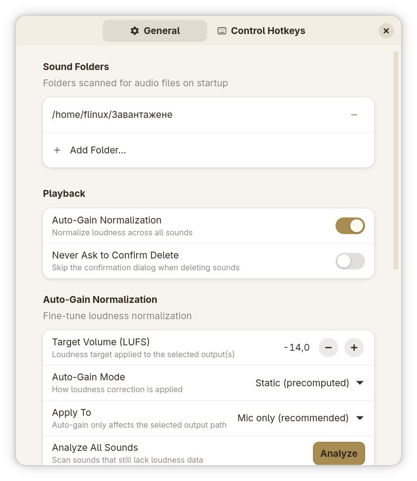
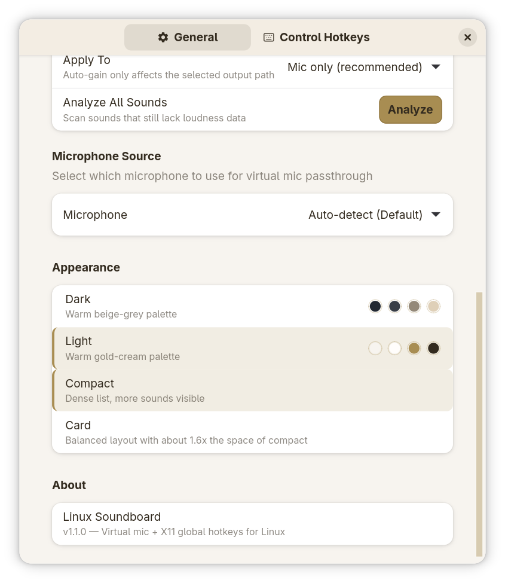
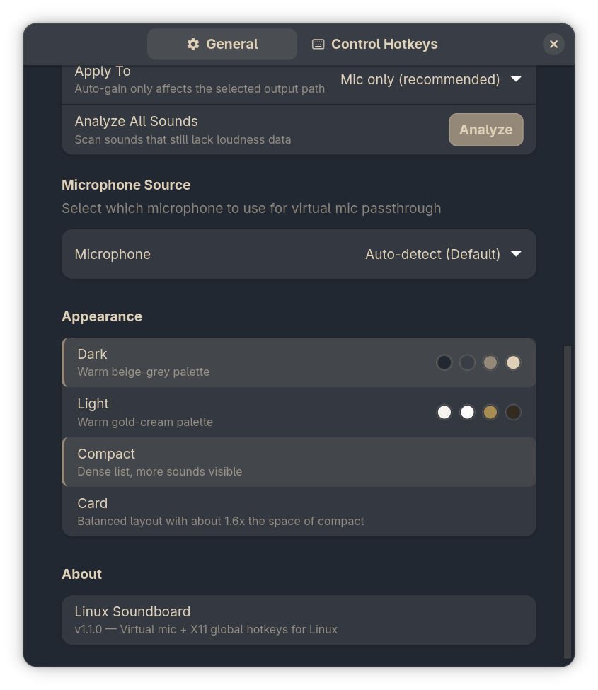
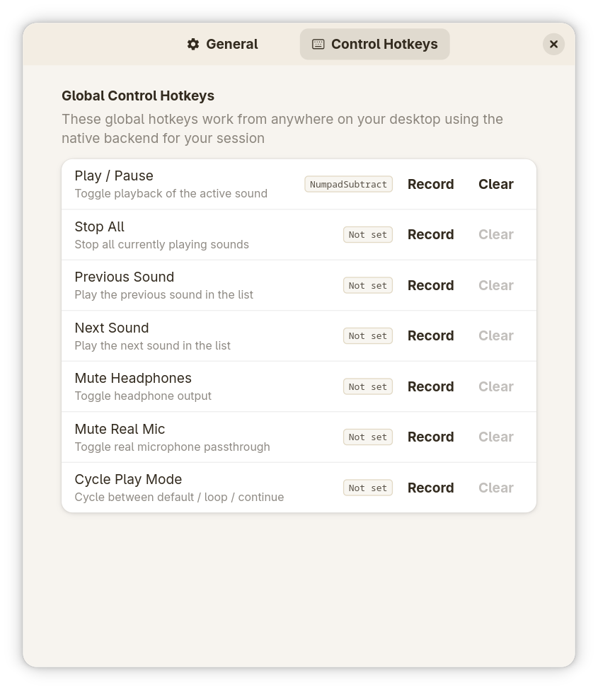

# Screenshot Gallery

The images in `assets/screenshots/` are the canonical visuals used by the docs.

## Main Window

| Dark | Light |
| --- | --- |
|  |  |

## Settings

| General settings | General settings, alternate view |
| --- | --- |
|  |  |
|  |  |

## Hotkeys

| Dark | Light |
| --- | --- |
|  |  |

## File Index

- `Main_dark.png`
- `Main_light.png`
- `Settings_dark1.png`
- `Settings_dark2.png`
- `Settings_hotkeys_dark.png`
- `Settings_hotkeys_light.png`
- `Settings_light1.png`
- `Settings_light2.png`

For a quick visual tour, see the screenshots embedded in [README.md](../README.md).
